# Futbol Scouting ve Performans Analizi Projesi

## 🎯 Proje Amacı

Bu projede, StatsBomb'un açık futbol verilerini analiz ederek takımların ve oyuncuların performansını değerlendirmeyi ve scouting sürecini daha etkili bir hale getirmeyi hedefledim. Çeşitli veri işleme ve analiz teknikleriyle futbol maçlarındaki önemli olayları detaylı bir şekilde inceleyerek anlamlı öngörüler sunmayı amaçladım.

## 📌 Proje Hedefleri

- Maç içerisindeki şut, pas ve diğer kritik olayları analiz etmek.
- xG (beklenen gol) analizleri ile şutların etkisini ölçmek.
- Oyuncu ve takım bazlı performans istatistiklerini çıkartmak.
- Taktik analizler ve pas ağları oluşturarak takım stratejilerini değerlendirmek.
- Elde edilen analizleri profesyonel görselleştirmelerle sunmak.

## 📈 Proje Sonuçları

1. **xG (Beklenen Gol) Analizleri:**
   - Ramona Bachmann, en yüksek toplam xG'ye sahip oyuncu olarak öne çıktı.
   - Şutların etkisini daha iyi değerlendirmek için detaylı xG analizleri gerçekleştirdim.

2. **Pas Analizleri:**
   - So-Yun Ji, 71 pasla en çok pas yapan oyuncu olarak dikkat çekti ve takımın pas ağında kilit bir rol oynadı.
   - Pas zincirlerini NetworkX ile grafik ağı şeklinde görselleştirdim.

3. **Taktik ve Formasyon Analizi:**
   - Manchester City WFC, 4-3-3 formasyonuyla sahaya çıkarken Chelsea FCW, 3-5-2 formasyonunu kullandı.
   - Takımların oyuncu konumlandırmalarını ve pas ağlarını detaylı bir şekilde inceledim.

4. **Dribbling ve Blok Analizleri:**
   - Ramona Bachmann, 12 dribbling ile sahadaki en etkili oyuncular arasında yer aldı.
   - Abbie McManus, 6 şut bloklama ile savunma başarısıyla öne çıktı.

---

## 📋 Projenin İçeriği

### 1. Veri Hazırlığı
- StatsBomb'un JSON formatındaki açık futbol verilerini analiz için kullandım.
- Verileri şut, pas ve diğer olay türlerine ayırarak CSV formatına dönüştürdüm.
- Verilerin temizlenmesi ve işlenmesi için Python ve pandas kütüphanelerini kullandım.
- İşlenmiş verileri `output/processed` klasöründe depoladım.

### 2. Şut Analizleri
- Şut lokasyonlarını bir ısı haritası ile görselleştirdim.
- Şut başarı oranlarını, xG değerlerini ve ilgili sonuçları detaylı olarak analiz ettim.
- Analiz sonuçlarını `filtered_shots.csv` dosyasına kaydettim.

### 3. Pas Analizleri
- Pas veren ve alan oyuncuları analiz ederek pas bağlantılarını çıkardım.
- Pas zincirlerini görselleştirmek için NetworkX kütüphanesini kullandım.
- Sonuçları `filtered_passes.csv` dosyasında sakladım.

### 4. Oyuncu ve Takım Performansı
- Oyuncuların şut, pas, dribbling ve blok gibi istatistiklerini analiz ettim.
- Takım bazında toplam şut ve pas analizlerini gerçekleştirdim.
- Tüm analiz sonuçlarını `player_performance.csv` dosyasına kaydettim.

### 5. xG Modeli
- Şutların gol olma ihtimallerini tahmin eden bir makine öğrenimi modeli geliştirdim.
- SMOTE ile sınıflar arasında denge sağladım ve modeli eğittim.
- Eğittiğim xG modelini `xg_model.pkl` dosyasında sakladım.

### 6. Görselleştirme
- Tableau kullanarak profesyonel görselleştirme çalışmaları gerçekleştirdim.
- Şut ısı haritaları, pas zincirleri ve xG analizlerini etkileyici bir şekilde görselleştirerek analizlerin daha anlaşılır olmasını sağladım.

---

## 🛠️ Kullanılan Teknolojiler

| **Teknoloji**          | **Kullanım Amacı**                             |
|------------------------|------------------------------------------------|
| Python                 | Veri analizi ve modelleme.                     |
| pandas                 | Veri manipülasyonu ve temizleme.               |
| NumPy                  | Sayısal verilerin işlenmesi.                   |
| Matplotlib & Seaborn   | Görselleştirme.                                |
| NetworkX               | Pas ağlarının görselleştirilmesi.              |
| Scikit-learn           | Makine öğrenimi modellemesi.                   |
| SMOTE                  | Sınıf dengesizliğini giderme.                  |
| Tableau                | Profesyonel veri görselleştirme.               |

---

## 🚀 Projenin Çalıştırılması

### Gereksinimler
- Python 3.8+
- Gerekli Python kütüphaneleri (pandas, matplotlib, seaborn, scikit-learn, imbalanced-learn, networkx)
- Tableau Public veya Desktop

### Kurulum
1. Gerekli Python paketlerini yüklemek için:
    ```bash
    pip install -r requirements.txt
    ```

2. JSON verilerini CSV'ye dönüştürmek için:
    ```bash
    python scripts/data_preparation.py
    ```

3. Analizleri çalıştırmak için:
    ```bash
    python main.py
    ```

4. Tableau ile görselleştirme için `output/processed` klasöründeki CSV dosyalarını kullanabilirsiniz.

---

## 📊 Görselleştirmeler ve Analizler

### 1. En Etkili Savunma Oyuncuları
Savunma oyuncularının şut bloklama ve müdahale istatistiklerini analiz ettim. Bu görsel, en fazla savunma aksiyonu gerçekleştiren oyuncuları sıralamaktadır.

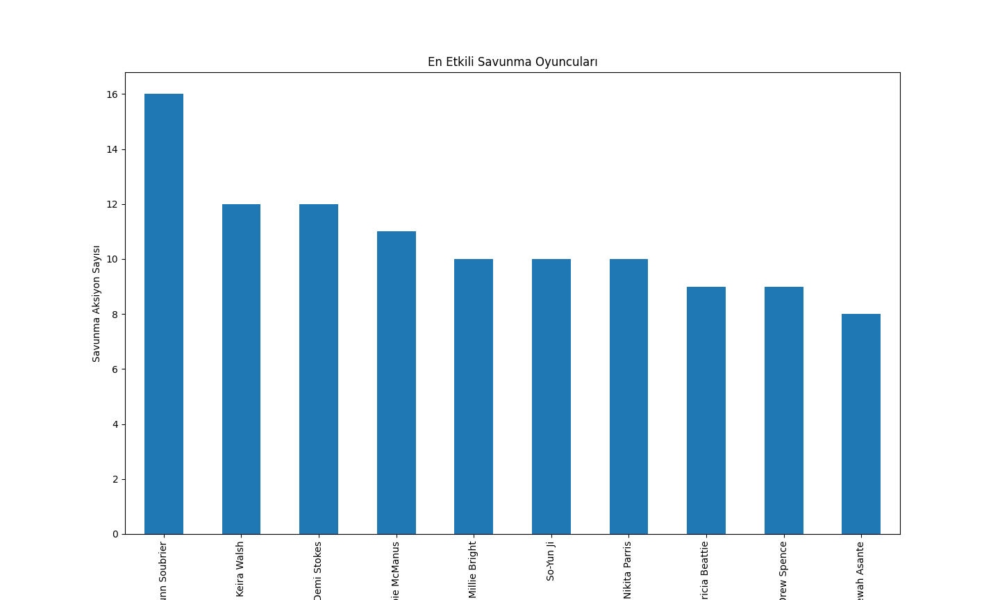

---

### 2. Dribbling Sıcaklık Haritası
Futbol sahasındaki dribbling aksiyonlarını analiz ederek, oyuncuların dribbling yaptığı bölgeleri görselleştirdim. Bu harita, dribbling yoğunluğunu saha üzerinde göstermektedir.

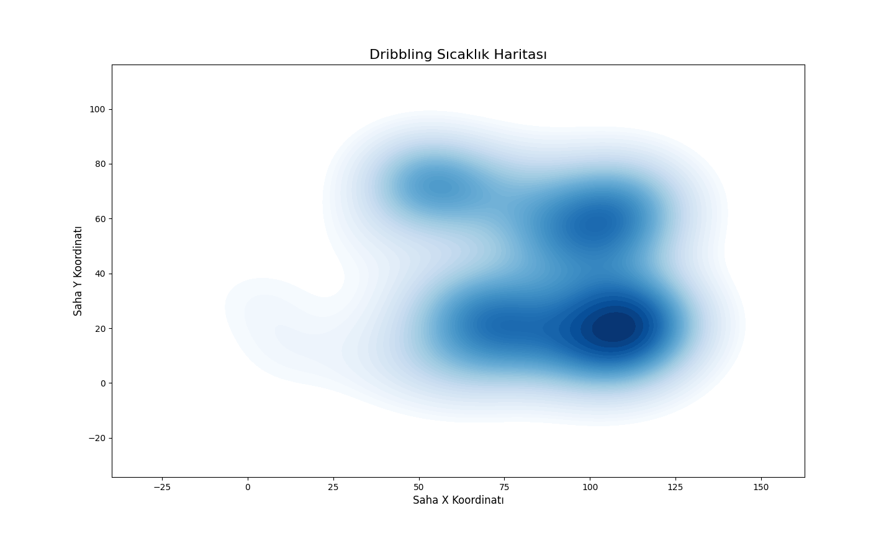

---

### 3. En Çok Faul Yapan Oyuncular
Oyuncuların faul yapma sıklığını analiz ettim. Bu görsel, en fazla faul yapan oyuncuları öne çıkarmaktadır.

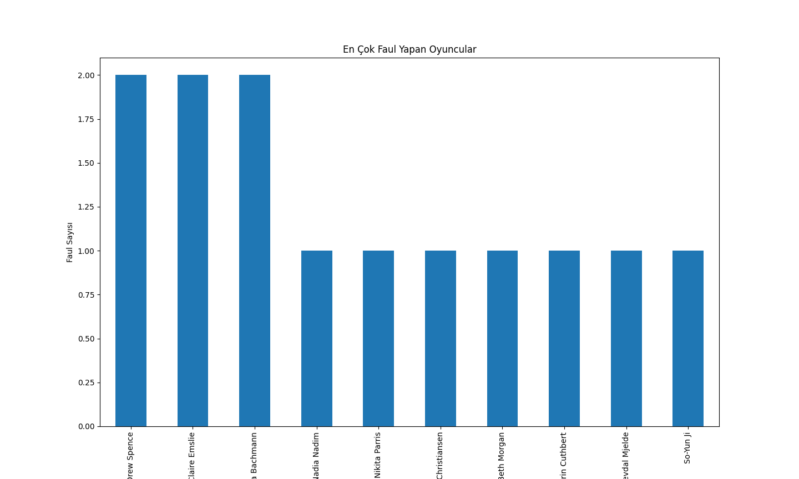

---

### 4. Şut Yoğunluğu Sıcaklık Haritası
Futbol sahasında şut çekilen bölgelerin yoğunluğunu analiz ettim. Bu harita, saha üzerindeki şutların yoğunluk noktalarını göstermektedir.

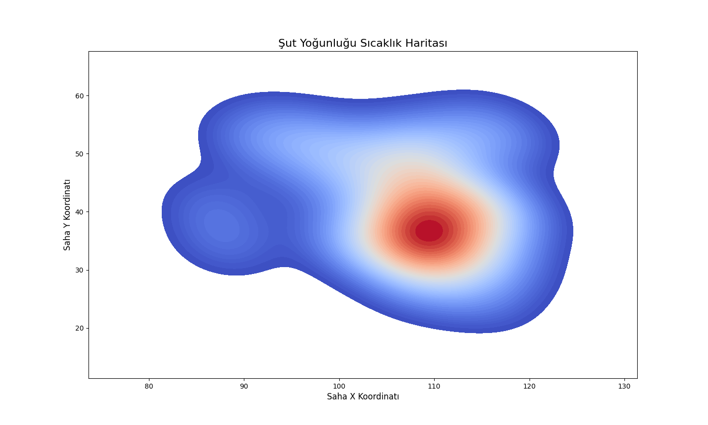

---

### 5. En Çok Pas Yapan Oyuncular
Oyuncuların pas sayısını analiz ederek, en fazla pas yapan oyuncuları belirledim. Bu görsel, takımın pas ağı içerisindeki en etkili oyuncuları göstermektedir.

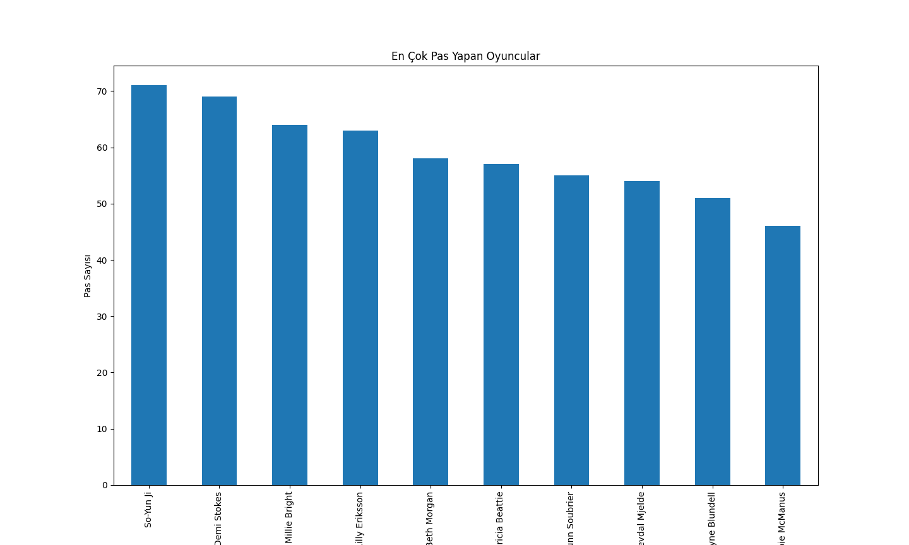

---

### 6. Oyuncu Bazlı Şut Başarı Oranı
Her oyuncunun şut başarı oranını analiz ettim. Bu görsel, oyuncuların golle sonuçlanan ve sonuçlanmayan şutlarını kıyaslamaktadır.

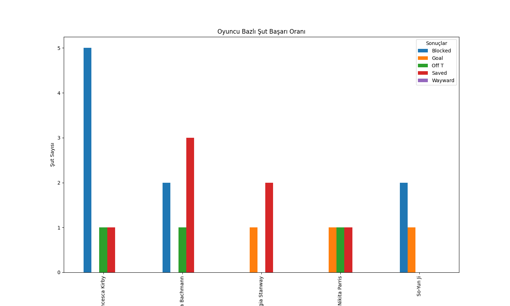

---

### 7. Şut Lokasyonları
Saha üzerinde oyuncuların şut çektiği noktaları analiz ettim. Bu görsel, şutların saha üzerindeki dağılımını göstermektedir.

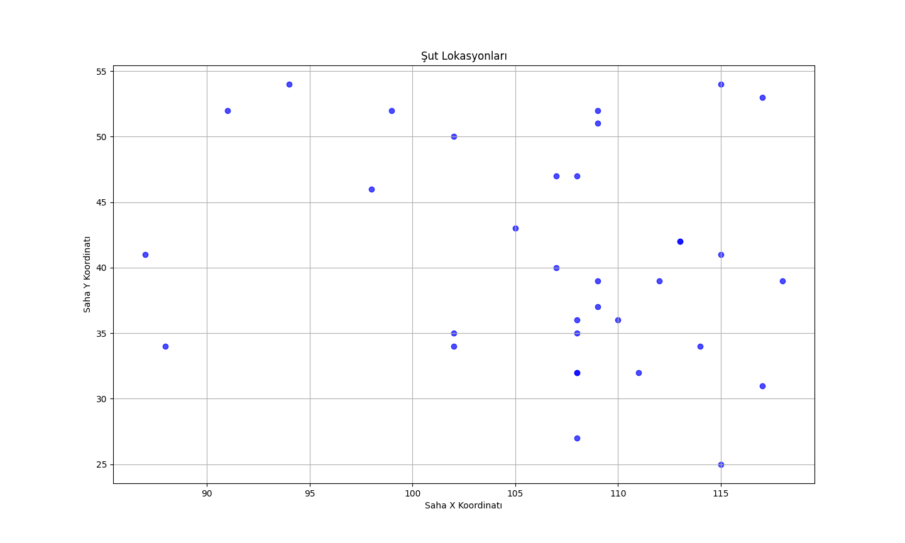

---

### 8. Şut Blokları Sıcaklık Haritası
Savunma oyuncularının şutları blokladığı bölgeleri analiz ettim. Bu harita, saha üzerinde bloklama aksiyonlarının yoğunluğunu görselleştirmektedir.

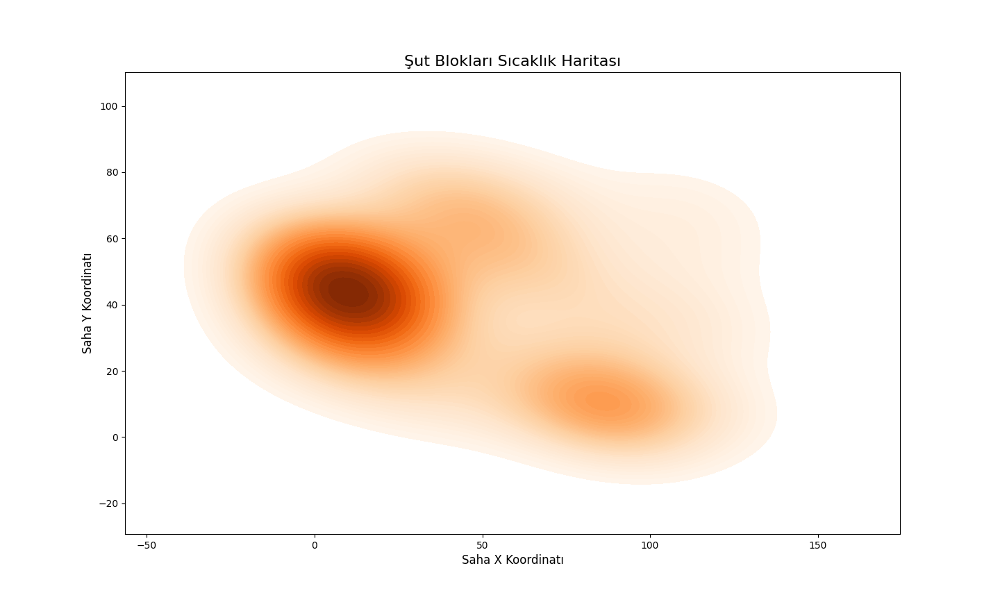

---

### 9. Şut Başarı Oranı
Takım bazında ve genel şut başarı oranlarını analiz ettim. Bu görsel, şutların sonuçlarını (gol, kaçırılan, bloklanan) detaylı olarak göstermektedir.

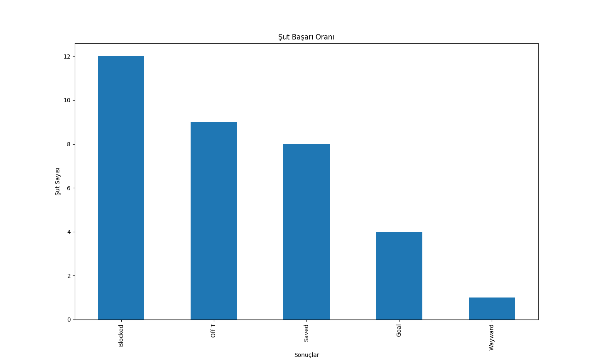

---

### 10. Pas Zinciri Ağı
Takımların pas bağlantılarını analiz ederek, oyuncular arasındaki pas ağını görselleştirdim. Bu grafik, takımın oyun kurma düzenini detaylı bir şekilde analiz etmektedir.

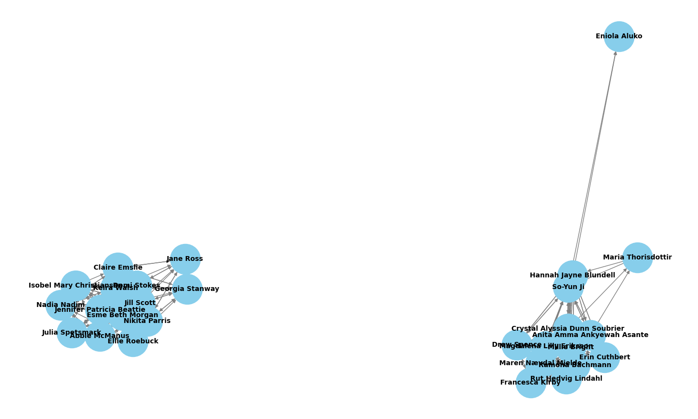

---

### 11. Takım Bazlı Şut Sayıları
Takımların toplam şut sayılarını analiz ederek, hücum etkinliklerini karşılaştırdım. Bu görsel, takımların hücumdaki üretkenliklerini kıyaslamaktadır.

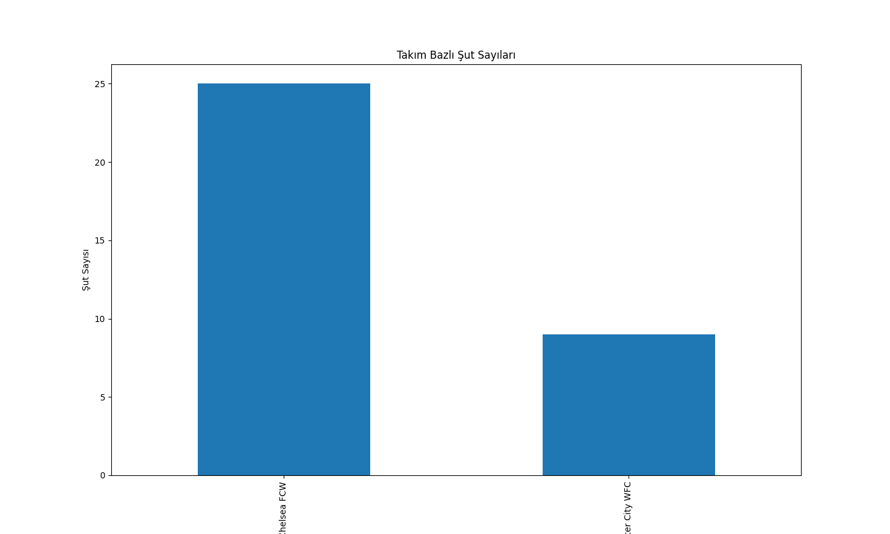

---

### 12. Beklenen Gol (xG) Dağılımı
Oyuncuların şutlarının gol olma ihtimallerini analiz ettim. Bu görsel, xG değerlerinin saha üzerindeki dağılımını ve oyuncu bazlı etkisini göstermektedir.

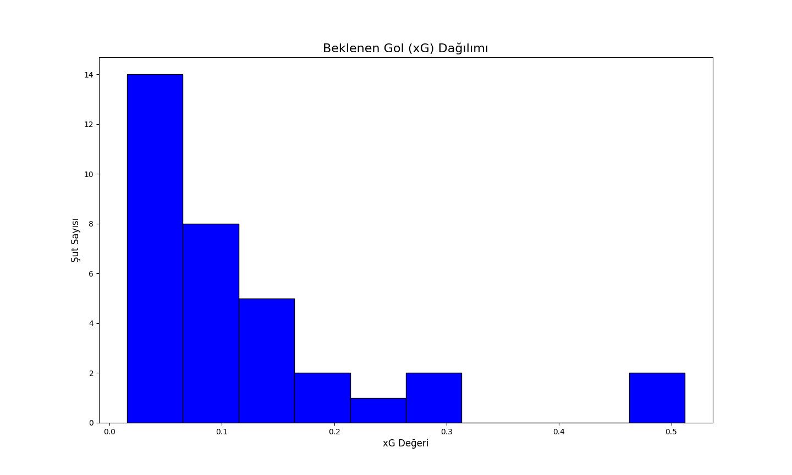

---

📂 Proje Yapısı

```plaintext
futbol_veri_analizi/
│
├── data/                 # Ham veri dosyalarını içerir
│   └── events/           # StatsBomb JSON veri dosyaları
│
├── metadata/             # Veri seti ile ilgili açıklamalar
│   └── dataset_info.json # Veri seti bilgileri
│
├── output/               # Analiz çıktıları ve görseller
│   ├── processed/        # İşlenmiş veri dosyaları (CSV)
│   │   ├── filtered_shots.csv
│   │   ├── filtered_passes.csv
│   │   └── player_performance.csv
│   ├── visuals/          # Görseller (PNG, PDF)
│   │   ├── shot_heatmap.png
│   │   ├── pass_network.png
│   │   ├── xg_analysis.png
│   │   └── dribbling_map.png
│   └── reports/          # Raporlar (Markdown, PDF)
│       ├── xg_report.pdf
│       └── player_analysis.md
│
├── scripts/              # Analiz ve veri işleme kodları
│   ├── shot_analysis.py
│   ├── pass_analysis.py
│   ├── xg_model.py
│   ├── dribbling_analysis.py
│   ├── shot_blocks_analysis.py
│   └── utils.py
│
├── logs/                 # Çalışma log dosyaları
│   └── analysis_log.txt
│
├── main.py               # Projeyi çalıştıran ana dosya
├── requirements.txt      # Gerekli Python paketleri
└── README.md             # Proje açıklamaları
```

---

## 📜 Lisans
Projeyi MIT Lisansı ile lisansladım. Lisans detayları için LICENSE dosyasını inceleyebilirsiniz.